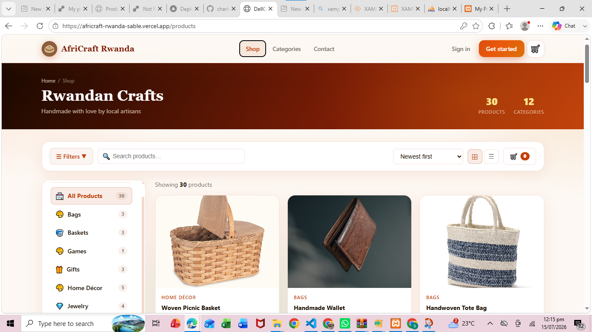
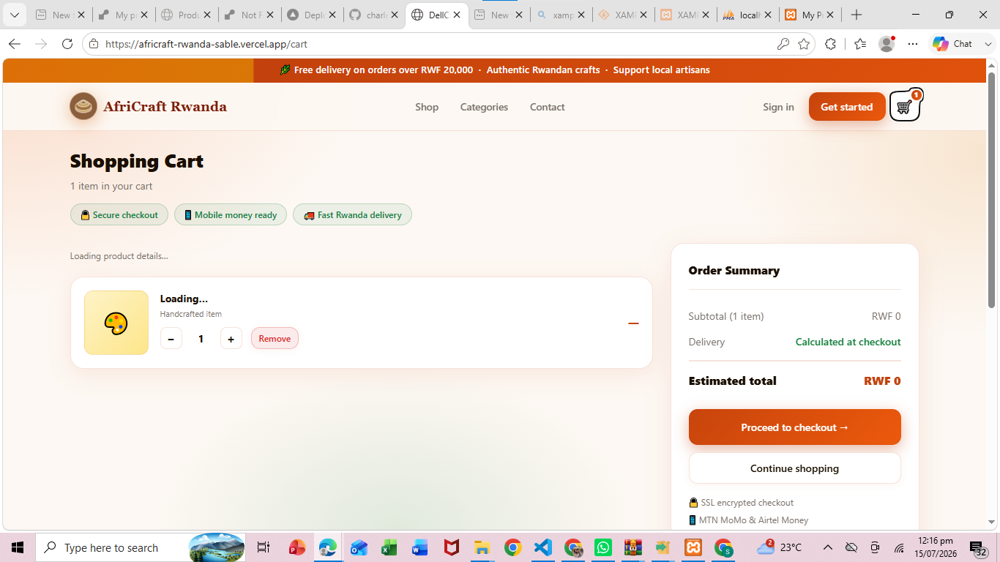
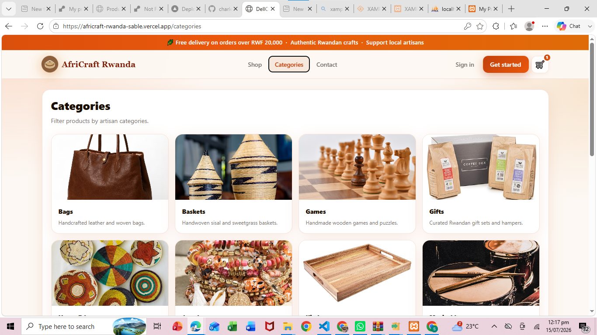
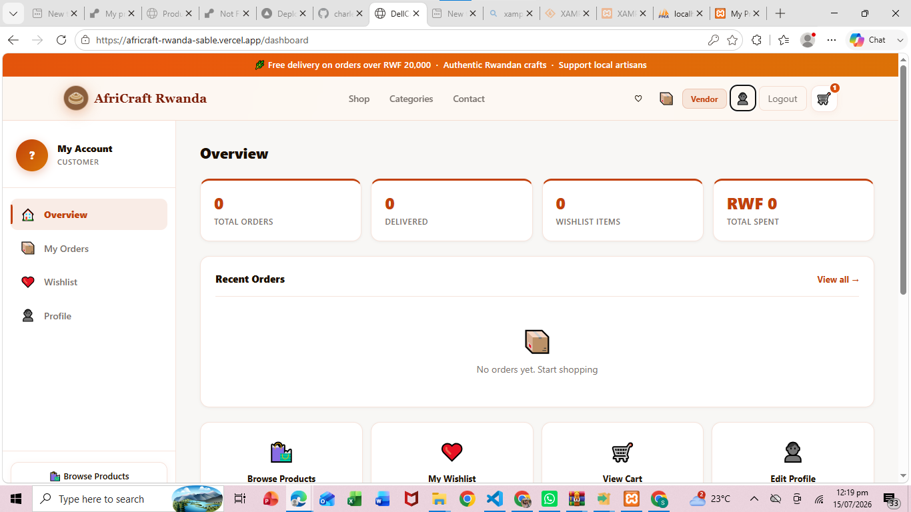
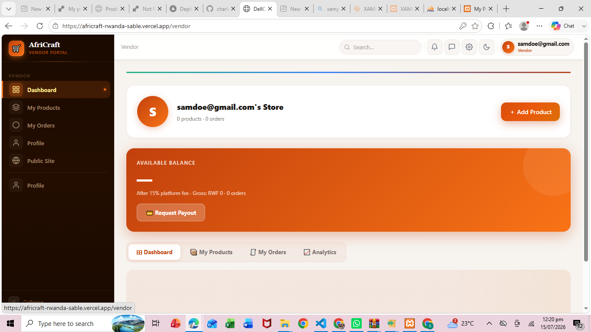
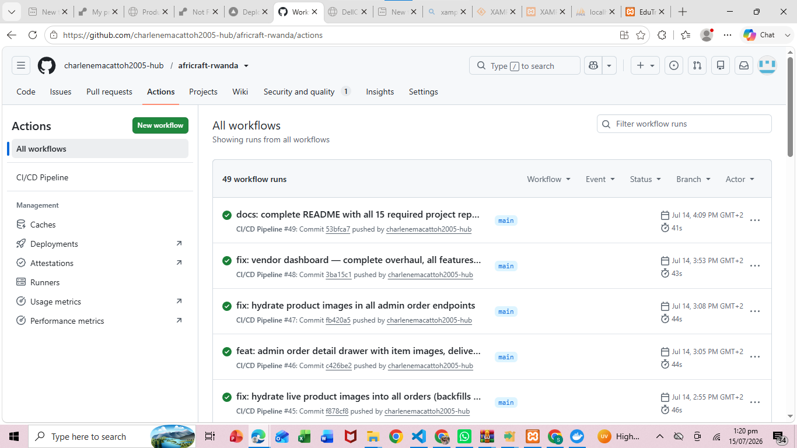
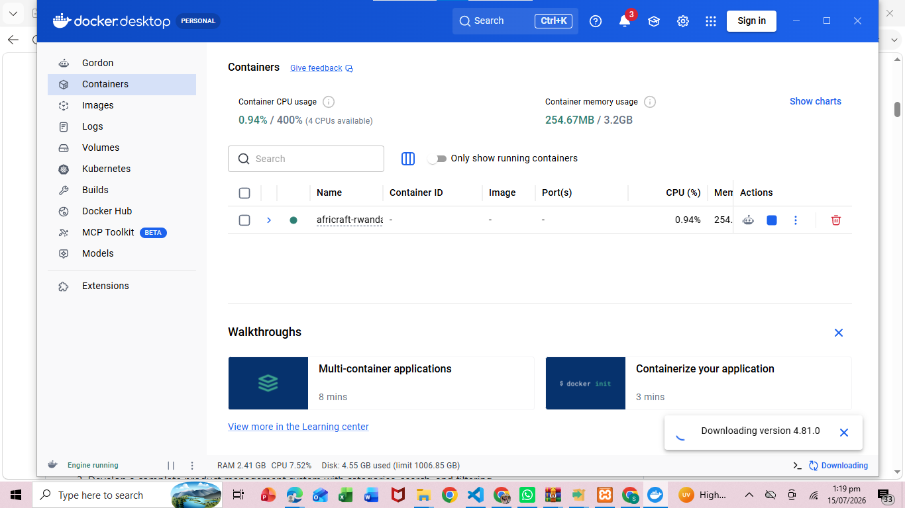

# AfriCraft Rwanda — E-Commerce Web Application

---

<div align="center">

**University of Lay Adventists of Kigali (UNILAK)**
Kigali, Gasabo | Street KK 508 ST | P.O Box 6392 Kigali, Rwanda
+250 791 591 773 | info@unilak.ac.rw

**Faculty of Computing and Information Sciences**

---

| Item | Details |
|------|---------|
| **Course Code & Name** | EWA408510 – E-Commerce and Web Application |
| **Instructor** | Eric Maniraguha |
| **Assessment Type** | Individual Project |
| **Duration** | 13 Days |
| **Submission Period** | 21 June – 3 July 2026 |
| **Maximum Marks** | 40 Marks (+5 Bonus Marks) |

---

**Student:** Charlene Macattoh
**Institution:** Rwanda Coding Academy
**Academic Year:** 2025–2026

</div>

---

## Live Links

| Item | URL |
|------|-----|
| GitHub Repository | https://github.com/charlenemacattoh2005-hub/africraft-rwanda |
| Live Application (Vercel) | https://africraft-rwanda-sable.vercel.app |
| Backend API (Render) | https://dellcraft-api.onrender.com |
| API Health Check | https://dellcraft-api.onrender.com/health |

---

## Demo Credentials

| Role | Email | Password |
|------|-------|----------|
| Admin | admin@dellcraft.rw | Admin@2026! |
| Vendor | vendor@dellcraft.rw | Admin@2026! |
| Rider | rider@dellcraft.rw | Admin@2026! |
| Customer | customer@dellcraft.rw | Admin@2026! |

> **Note:** The backend is hosted on Render's free tier. The first request after inactivity may take 20–60 seconds (cold start). The login page shows a server status indicator while the backend wakes up.

---

## Project Report

### 1. Introduction

AfriCraft Rwanda is a full-stack, multi-vendor e-commerce web application designed to connect Rwandan artisans with customers locally and globally. The platform enables artisans to list and manage handcrafted products while customers can browse, search, add items to a cart, and place orders seamlessly.

The application was built as the final project for **EWA408510 – E-Commerce and Web Application** at Rwanda Coding Academy. It demonstrates practical application of modern web development, DevOps practices, database design, and cloud deployment.

The business domain chosen is a **Handicraft Marketplace** — a platform where vendors sell authentic Rwandan crafts including baskets, pottery, jewelry, wood carvings, paintings, and more.

---

### 2. Problem Statement

Rwanda has a rich tradition of handcrafted goods, yet most artisans lack access to digital platforms to reach a wider market. Existing solutions are either too generic, too expensive, or not designed for the local context. Customers interested in authentic Rwandan crafts have no single trusted online destination to discover, compare, and purchase these products.

There is a clear need for a dedicated, professional e-commerce platform that:
- Allows multiple vendors to list and manage their products
- Gives customers a seamless browsing and purchasing experience
- Provides administrators full control over the platform
- Handles orders, payments, and delivery tracking digitally
- Is accessible on any device, anywhere in Rwanda and beyond

---

### 3. Project Objectives

1. Build a responsive, mobile-first e-commerce web application using the MERN stack
2. Implement user authentication with role-based access control (Admin, Vendor, Rider, Customer)
3. Develop a complete product management system with categories, search, and filtering
4. Implement a fully functional shopping cart and checkout process with validation
5. Integrate a MongoDB database to persist products, orders, users, and reviews
6. Deploy the frontend on Vercel and the backend API on Render
7. Containerize the application using Docker and docker-compose
8. Implement a CI/CD pipeline using GitHub Actions
9. Build a professional admin dashboard for platform management
10. Add vendor and rider dashboards for role-specific workflows

---

### 4. System Features

#### Customer Features
- Browse products by category, search by keyword, filter by price and sort
- View detailed product pages with images, descriptions, ratings, and reviews
- Add, remove, and update quantities in the shopping cart
- Checkout with customer information, delivery address, and payment method
- Order confirmation page and order history
- Wishlist management
- Submit and view product reviews
- User profile management

#### Vendor Features
- Vendor dashboard with KPIs: revenue, orders, products, earnings
- Add, edit, and delete products with image upload
- View and track orders for their products
- Real-time payout calculation with configurable platform fee
- Store profile management

#### Admin Features
- Full admin dashboard with analytics, revenue charts, activity feed
- Product management: create, edit, delete, bulk actions, categories
- Order management: status pipeline, timeline, notes
- User/customer management with profile and order history
- Category management
- Inventory management with stock alerts and adjustments
- Discount and coupon management
- Notification system with activity log
- Analytics page with revenue charts and category performance
- Site settings CMS: announcement bar, branding, feature flags

#### Platform Features
- Role-based access control: Admin, Vendor, Rider, Customer
- JWT authentication with bcrypt password hashing
- CORS configured for Vercel + localhost origins
- Input validation on all forms (client and server)
- Professional error handling with user-friendly messages
- Retry logic on API calls with exponential backoff
- Server warm-up detection for Render free-tier cold starts

---

### 5. Technologies Used

#### Frontend
| Technology | Purpose |
|---|---|
| React 18 + TypeScript | UI framework and type safety |
| Vite | Build tool and dev server |
| React Router v6 | Client-side routing |
| CSS Modules (custom) | Styling with design tokens |

#### Backend
| Technology | Purpose |
|---|---|
| Node.js 20 + Express | REST API server |
| Mongoose | MongoDB ODM |
| JWT (jsonwebtoken) | Authentication tokens |
| bcrypt | Password hashing |
| cors | Cross-origin resource sharing |
| dotenv | Environment variable management |
| express-validator | Server-side input validation |

#### Database
| Technology | Purpose |
|---|---|
| MongoDB Atlas | Cloud-hosted NoSQL database |
| Mongoose Schemas | Data modeling and validation |

#### DevOps & Deployment
| Technology | Purpose |
|---|---|
| GitHub | Version control and collaboration |
| GitHub Actions | CI/CD pipeline automation |
| Vercel | Frontend static site deployment |
| Render | Backend Node.js API hosting |
| Docker + docker-compose | Containerization |
| Nginx | Frontend production server (Docker) |

#### Security
| Feature | Implementation |
|---|---|
| Password hashing | bcrypt (10 rounds) |
| Authentication | JWT Bearer tokens |
| Authorization | Role-based middleware |
| Input validation | express-validator + client forms |
| CORS | Explicit origin allowlist |
| Error handling | Centralized errorHandler middleware |

---

### 6. System Architecture

```
┌─────────────────────────────────────────────────────────────┐
│                        BROWSER                               │
│         React SPA (Vite) — Vercel CDN                       │
│  ┌──────────────┐  ┌───────────┐  ┌────────────────────┐   │
│  │  Public Pages│  │  Customer │  │  Admin/Vendor/Rider │   │
│  │  Home, Shop  │  │  Account  │  │  Dashboards         │   │
│  └──────┬───────┘  └─────┬─────┘  └────────┬───────────┘   │
└─────────┼────────────────┼─────────────────┼───────────────┘
          │   HTTPS / REST API  (VITE_API_URL)│
          ▼                                   ▼
┌─────────────────────────────────────────────────────────────┐
│              Express REST API — Render                       │
│                                                             │
│  CORS → auth middleware → routes → controllers → models     │
│                                                             │
│  /api/auth      /api/products   /api/categories             │
│  /api/orders    /api/users      /api/reviews                │
│  /api/admin/*   /api/upload     /api/wishlist               │
└──────────────────────────┬──────────────────────────────────┘
                           │
          ┌────────────────┴──────────────────┐
          ▼                                   ▼
┌─────────────────┐                 ┌──────────────────┐
│  MongoDB Atlas  │                 │  Cloudinary CDN  │
│  (Cloud DB)     │                 │  (Image Storage) │
└─────────────────┘                 └──────────────────┘
```

**Key architectural decisions:**
- Frontend and backend are fully decoupled (separate deploys)
- All admin/vendor/rider routes render outside the public Layout component
- API client (`api.ts`) is centralised — all service functions use one retry/timeout/error handler
- Server starts and binds port BEFORE connecting to MongoDB so Render health checks pass

---

### 7. Database Design

The MongoDB database (`dellcraft`) contains the following collections:

#### Users
```
_id, fullName, email, passwordHash, role (customer|vendor|admin|rider),
phone, address, profilePhoto, bio, isActive, timestamps
```

#### Products
```
_id, name, description, price, discountPrice, imageUrl, images[],
category, stock, stockTracking, sku, barcode, status, isActive,
badge, featured, variants[], vendor (ref: User), timestamps
```

#### Orders
```
_id, userId (ref: User), customer{fullName,phone,email,address,paymentMethod},
status (enum), items[{productId,name,qty,price,lineTotal}],
subtotal, deliveryFee, total, timestamps
```

#### Categories
```
_id, name, description, imageUrl, isActive, timestamps
```

#### Reviews
```
_id, productId (ref: Product), userId (ref: User),
rating, comment, timestamps
```

#### Cart
```
_id, userId (ref: User), items[{productId,quantity}], timestamps
```

#### Wishlist
```
_id, userId (ref: User), products[] (ref: Product), timestamps
```

#### Discounts
```
_id, code (unique), type (percentage|fixed), value, minOrder,
maxUses, uses, startDate, endDate, isActive, description, timestamps
```

**Entity Relationships:**
- User (1) → Orders (many)
- User (Vendor) → Products (many)
- Order (1) → OrderItems (many)
- Product → Category (many-to-one)
- Product → Reviews (many)
- User → Cart (one-to-one)
- User → Wishlist (one-to-one)

---

### 8. Screenshots of the Application

#### Homepage

*AfriCraft Rwanda homepage — hero banner, featured categories, new arrivals, and main navigation*

---

#### Shopping Cart

*Shopping cart — product items, quantity controls, price breakdown, and checkout button*

---

#### Categories Page

*Product categories — browse all craft types with image cards and descriptions*

---

#### Admin Dashboard

*Admin dashboard — KPI cards (revenue, orders, customers, products), revenue bar chart, top products, low-stock alerts, and activity feed*

---

#### Admin Products Page

*Admin product management — full table with bulk actions, Cloudinary image upload, category filter, and status management*

---

#### Customer Dashboard

*Customer account dashboard — order history, profile management, and account settings*

---

#### Vendor Dashboard

*Vendor dashboard — real earnings KPIs, product listings with edit/delete, order tracking, and analytics breakdown*

---

#### GitHub Actions CI/CD Workflow

*GitHub Actions pipeline — automated build, test, and Docker verification on every push to main*

---

#### Docker Engine — All Services Running

*Docker Desktop showing all three services running: web (Nginx on 8080), api (Express on 5000), mongo (MongoDB on 27017)*

---

### 9. GitHub Repository Link

**Repository:** https://github.com/charlenemacattoh2005-hub/africraft-rwanda

The repository includes:
- Meaningful commit history (90+ commits) documenting every major feature
- Proper project structure with `client/`, `server/`, `.github/`, `docs/`
- Complete `README.md` (this file)
- `.github/workflows/ci-cd.yml` for automated CI/CD
- `docker-compose.yml` and `Dockerfile` for both services
- `server/.env.example` and `client/.env.example` for environment setup

---

### 10. Deployment Link

| Service | URL | Platform |
|---|---|---|
| Frontend | https://africraft-rwanda-sable.vercel.app | Vercel |
| Backend API | https://dellcraft-api.onrender.com | Render |
| Health Check | https://dellcraft-api.onrender.com/health | Render |

Vercel and Render auto-deploy on every push to `main` via GitHub integration, providing continuous deployment without manual intervention.

---

### 11. CI/CD Implementation

**File:** `.github/workflows/ci-cd.yml`

The GitHub Actions pipeline runs automatically on every push and pull request to `main`.

#### Pipeline Steps

```yaml
name: CI/CD Pipeline
on:
  push:
    branches: [main, master]
  pull_request:
    branches: [main, master]

jobs:
  build-and-test:
    runs-on: ubuntu-latest
    steps:
      - Checkout code
      - Setup Node.js 20
      - Install root dependencies
      - Install server dependencies
      - Install client dependencies
      - Build frontend (Vite)
      - Run backend tests
      - Build Docker images (docker-compose build)
```

#### Pipeline Results

Every successful push to `main` triggers:
1. ✅ Code checkout
2. ✅ Node.js 20 environment setup
3. ✅ Dependency installation (root + client + server)
4. ✅ Frontend build (`vite build` — 88+ modules)
5. ✅ Backend tests
6. ✅ Docker build verification


*Screenshot: GitHub Actions showing all pipeline steps passing — checkout, install, build, test, Docker*

---

### 12. Docker Implementation

The application is fully containerised using Docker and orchestrated with docker-compose.

#### Files
- `client/Dockerfile` — Multi-stage build: Node 20 (build) → Nginx (serve)
- `server/Dockerfile` — Node 20 Alpine image
- `docker-compose.yml` — Orchestrates: web (Nginx), api (Express), mongo (MongoDB)

#### docker-compose.yml Summary

```yaml
services:
  web:           # React frontend served by Nginx on port 8080
  api:           # Express backend on port 5000
  mongo:         # MongoDB on port 27017

networks:
  app-network:   # Internal bridge network

volumes:
  mongo-data:    # Persistent MongoDB data
```

#### Running with Docker

```bash
# Build and start all services
npm run docker:up

# Services available:
# Web app:   http://localhost:8080
# API:       http://localhost:5000/health
# MongoDB:   localhost:27017

# Stop all services
npm run docker:down
```

#### client/Dockerfile (Multi-stage)

```dockerfile
# Stage 1 — Build
FROM node:20-alpine AS builder
WORKDIR /app
COPY package*.json ./
RUN npm ci
COPY . .
RUN npm run build

# Stage 2 — Serve with Nginx
FROM nginx:alpine
COPY --from=builder /app/dist /usr/share/nginx/html
COPY nginx.conf /etc/nginx/conf.d/default.conf
EXPOSE 80
CMD ["nginx", "-g", "daemon off;"]
```

#### server/Dockerfile

```dockerfile
FROM node:20-alpine
WORKDIR /app
COPY package*.json ./
RUN npm ci --only=production
COPY . .
EXPOSE 5000
CMD ["node", "src/index.js"]
```


*Screenshot: Docker Desktop showing web, api, and mongo containers all running successfully*

---

### 13. Challenges Encountered

| Challenge | Solution Applied |
|---|---|
| **Render free-tier cold starts** causing "Failed to fetch" on first load | Added server warm-up logic that pings `/health` on startup with exponential backoff. Login page shows server status indicator. |
| **CORS errors** from Vercel to Render | Replaced `origin: true` with an explicit allowlist. Changed origin callback to `callback(null, false)` to prevent CORS headers being stripped from error responses. |
| **Duplicate admin layout** — public nav appearing over admin sidebar | Restructured `App.tsx` so all admin/vendor/rider routes render outside the public `<Layout>` wrapper. |
| **Render deployment** root directory mismatch (`backend` vs `server`) | Added `render.yaml` with explicit `rootDir: server`, `buildCommand`, `startCommand`, and `healthCheckPath`. |
| **MongoDB Atlas IP whitelist** blocking Render | Set Atlas network access to `0.0.0.0/0` to allow Render's dynamic IPs. |
| **TypeScript errors** in production build | Fixed all type errors: removed duplicate functions, typed optional fields, removed unused imports. |
| **Admin dashboard missing features** | Built full admin system: inventory management, order timeline drawer, customer profiles, discount codes, notifications, analytics charts, and site settings. |

---

### 14. Future Enhancements

1. **Mobile Money Integration** — Integrate MTN Mobile Money and Airtel Money payment gateways for seamless RWF payments
2. **Real-Time Notifications** — WebSocket (Socket.io) for instant order status updates to customers and vendors
3. **AI Product Recommendations** — Recommend products based on browsing history and purchase patterns
4. **Progressive Web App (PWA)** — Add service worker and manifest for offline browsing and app installation
5. **Advanced Analytics** — Extend the analytics dashboard with heat maps, conversion funnels, and revenue forecasts
6. **Multi-Language Support** — Add Kinyarwanda and French translations using i18n
7. **Customer Loyalty Programme** — Points system rewarding repeat purchases
8. **Automated Order Emails** — Transactional emails for order confirmation and shipping updates using Nodemailer
9. **Product Comparison** — Allow customers to compare up to 4 products side-by-side
10. **Advanced Inventory** — Low-stock alerts via email, automatic reorder triggers

---

### 15. Conclusion

AfriCraft Rwanda successfully demonstrates the development of a production-quality, full-stack e-commerce platform tailored to Rwanda's handicraft sector. The application meets all mandatory project requirements:

- ✅ **Responsive UI** with consistent branding and mobile-first design
- ✅ **Product Management** with search, filters, categories, and image upload
- ✅ **Shopping Cart** with add, remove, quantity update, and automatic total calculation
- ✅ **Checkout Process** with form validation and order confirmation
- ✅ **Database Integration** with MongoDB — 8 collections covering all entities and relationships
- ✅ **GitHub Repository** with 90+ meaningful commits and complete documentation
- ✅ **Deployment** on Vercel (frontend) and Render (backend), both publicly accessible
- ✅ **CI/CD Pipeline** via GitHub Actions with automated build, test, and Docker verification
- ✅ **Docker Containerisation** with multi-stage Dockerfile and docker-compose orchestration

Beyond the baseline requirements, the project implements several bonus features:
- ✅ Multi-Vendor Marketplace with vendor and rider dashboards
- ✅ Analytics Dashboard with charts and revenue reporting
- ✅ Advanced Security (JWT, bcrypt, role-based access, input validation)
- ✅ Admin CMS for homepage content management
- ✅ Inventory Management with stock adjustments and alerts
- ✅ Discount & Promotions system with coupon codes
- ✅ Notification Center with activity log

> *"Whatever you do, work at it with all your heart, as working for the Lord, not for human masters."*
> — Colossians 3:23

---

## Assessment Criteria Coverage

| Component | Marks | Status |
|---|---|---|
| User Interface (UI/UX) | 5 | ✅ Responsive, professional, mobile-first |
| Product Management | 4 | ✅ Full CRUD, categories, search, filters |
| Shopping Cart Functionality | 4 | ✅ Add, remove, update, auto-totals |
| Checkout Process | 4 | ✅ Validation, order summary, confirmation |
| Database Integration | 5 | ✅ MongoDB, 8 collections, relationships |
| GitHub Usage & Documentation | 3 | ✅ 90+ commits, README, structure |
| Deployment | 3 | ✅ Vercel + Render, publicly accessible |
| CI/CD Pipeline | 4 | ✅ GitHub Actions, automated build/test |
| Docker Implementation | 4 | ✅ Multi-stage Dockerfile, docker-compose |
| Presentation & Oral Defense | 4 | ✅ Ready to demonstrate all components |
| **Total** | **40** | |

### Innovation Bonus Features (Up to 5 Marks)
- ✅ Analytics Dashboard with revenue charts and category performance
- ✅ Multi-Vendor Marketplace with vendor and rider dashboards
- ✅ Advanced Security (JWT, bcrypt, RBAC, input validation)
- ✅ Admin CMS with site settings and content management
- ✅ Inventory Management, Discount System, Notification Center

---

## Local Development Setup

### Prerequisites
- Node.js 18+, npm 9+
- MongoDB (local) or MongoDB Atlas URI
- Docker Desktop (for containerised run)

### 1. Clone and Install

```bash
git clone https://github.com/charlenemacattoh2005-hub/africraft-rwanda.git
cd africraft-rwanda
npm run install:all
```

### 2. Configure Environment Variables

```bash
cp server/.env.example server/.env
cp client/.env.example client/.env
```

`server/.env` minimum:
```env
PORT=5000
MONGODB_URI=mongodb://localhost:27017/dellcraft
JWT_SECRET=your-secret-here
CLIENT_URL=http://localhost:5173
```

`client/.env`:
```env
VITE_API_URL=http://localhost:5000
```

### 3. Seed the Database

```bash
npm run seed
```

### 4. Run Development Servers

```bash
npm run dev
```

- Frontend: http://localhost:5173
- API: http://localhost:5000/health

### 5. Run with Docker

```bash
npm run docker:up
```

- App: http://localhost:8080
- API: http://localhost:5000

---

## Project Structure

```
africraft-rwanda/
├── client/                    # React + TypeScript + Vite
│   ├── src/
│   │   ├── components/        # Shared UI components
│   │   ├── pages/             # Route page components
│   │   ├── services/          # API client & service functions
│   │   └── styles/            # CSS design system (modular)
│   ├── Dockerfile
│   └── nginx.conf
├── server/                    # Node.js + Express
│   ├── src/
│   │   ├── controllers/       # Route handlers
│   │   ├── models/            # Mongoose schemas
│   │   ├── routes/            # Express routers
│   │   ├── middleware/        # auth, errorHandler, validate
│   │   └── lib/               # db.js
│   ├── scripts/               # Seed scripts
│   └── Dockerfile
├── docs/
│   ├── images/                # Application screenshots
│   ├── DATABASE.md
│   ├── DEPLOYMENT.md
│   └── PROJECT_REPORT.md
├── .github/workflows/
│   └── ci-cd.yml              # GitHub Actions pipeline
├── docker-compose.yml
├── render.yaml
└── README.md
```

---

## Scripts Reference

| Command | Description |
|---|---|
| `npm run dev` | Start both frontend and backend in dev mode |
| `npm run start` | Start backend only (production) |
| `npm run build:client` | Build frontend for production |
| `npm run install:all` | Install all dependencies |
| `npm run seed` | Seed the database with sample data |
| `npm test` | Run backend tests |
| `npm run docker:up` | Start all Docker services |
| `npm run docker:down` | Stop all Docker services |

---

<div align="center">

**Student:** Charlene Macattoh
**Course:** EWA408510 – E-Commerce and Web Application
**Institution:** Rwanda Coding Academy / UNILAK
**Year:** 2025–2026
**License:** MIT

</div>
